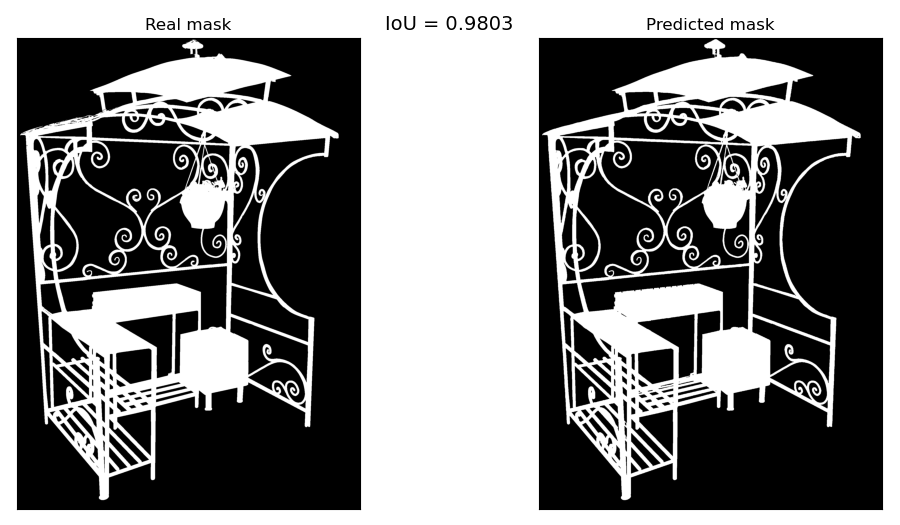
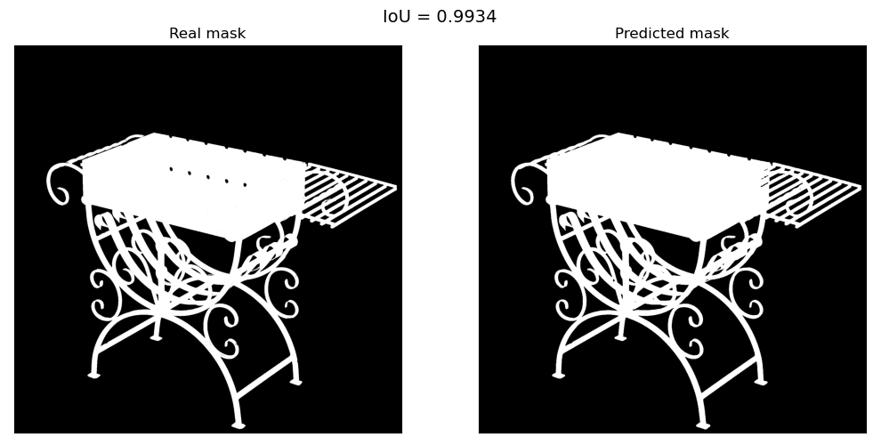
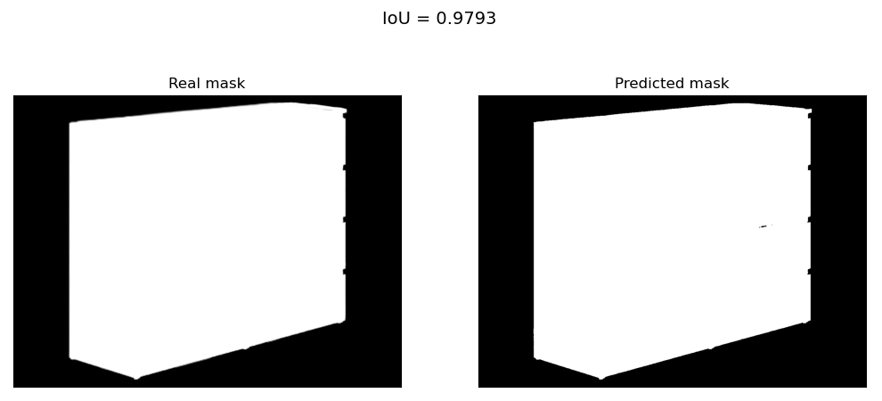
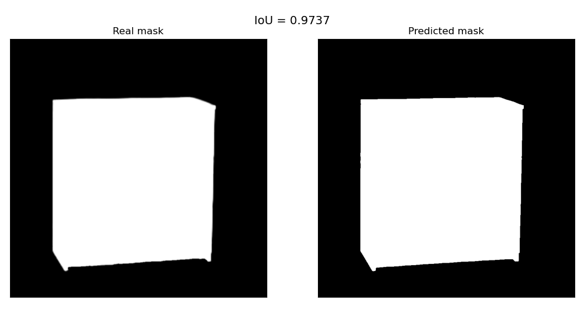
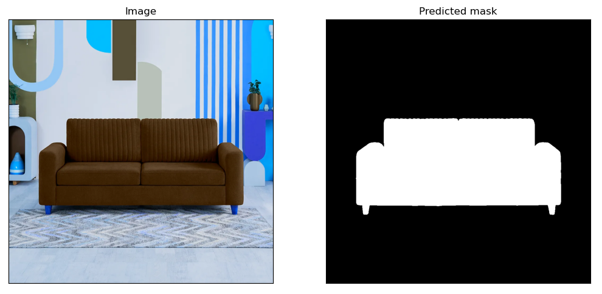
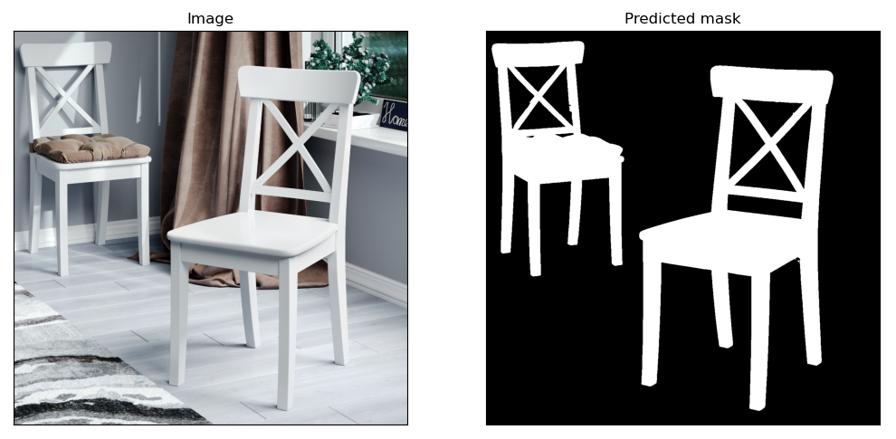
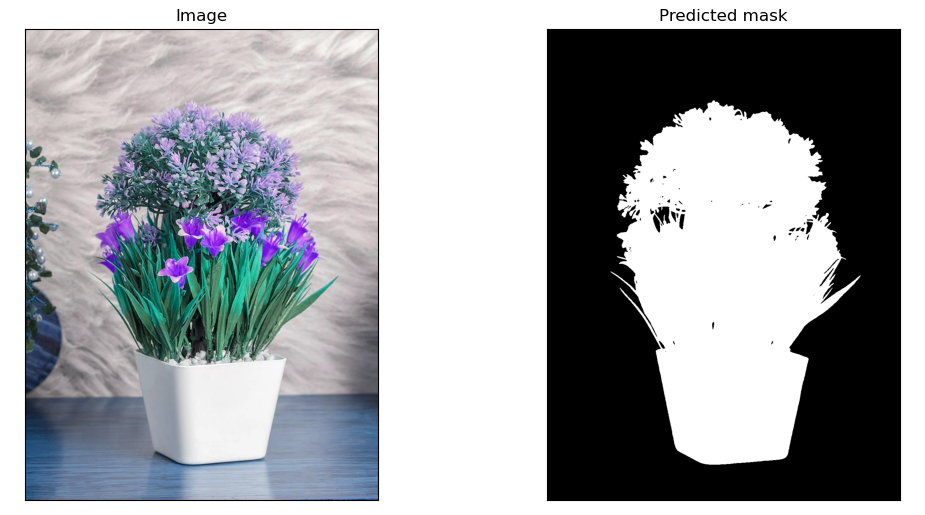
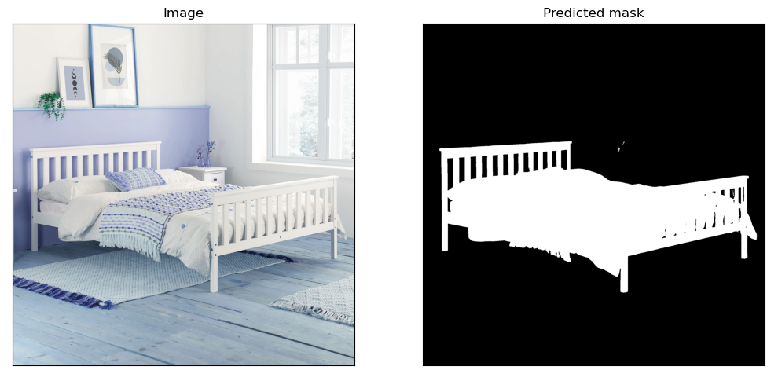

## Цель работы

 - Написать скрипт, который будет удалять фон с изображений;
 - рассчитать метрику IoU для каждого изображения по маскам;
 - рассчитать среднее значение метрики IoU по всем изображениям;
 - использовать средства, разрешённые для коммерческого использования.

## Ход работы

В ходе решения задачи, мною были рассмотрены и протестированы различные библиотеки и способы, не вошедшие в итоговое решение.

### Рассмотренные способы реализации:

- [библиотека Rembg](https://github.com/danielgatis/rembg/tree/main?tab=readme-ov-file) - библиотека представляет из себя удобный конструктор,
предназначенный для удаления фона, в котором доступно несколько моделей. Интерес для данной задачи представляют модели **u2net** и **isnet-general-use**.
Первая модель хорошо показала себя при работе с простыми объектами, однако из-за своих особенностей **u2net** не способна выделять мелкие детали,
смешивая всё в общую маску. Вторая модель - **isnet-general-use** - напротив, хорошо проявила себя при работе со сложными объектами, но не справилась
с переменной цветовой гаммой на простых изображениях, из-за чего маскирование происходило по затенённой стороне центрального объекта.

- SAM показала хорошие результаты, однако на данном этапе мне не удалось избавиться от неточностей при построении маски на сложных объектах.

- [библиотека transparent-background](https://github.com/plemeri/transparent-background?tab=readme-ov-file) - выбранное мной решение для данной задачи.

### Итоговое решение:

Библиотека **transparent-background** представляет из себя библиотеку-конструктор на базе [InSPyReNet](https://github.com/plemeri/InSPyReNet/tree/main),
специально созданную для маскирования и удаления фона с изображений и видео. В основе InSPyReNet лежит Swin Transformer.

Плюсы выбранного подхода:
+ хороший результат как на простых, так и на сложных объектах;
+ возможность использовать различные checkpoints;
+ возможность дообучения сети под свои задачи.

Результаты:

<kbd></kbd>

На данном скриншоте, можно заметить, что в некоторых случаях (левая часть нижней крыши) InSPyReNet распознаёт маску немного лучше, чем предложенный вариант.

<kbd></kbd>

<kbd></kbd>

<kbd></kbd>

Также была произведена оценка возможности библиотеки на изображениях с более сложным фоном.

Примеры работ с не монотонным фоном:

<kbd></kbd>

<kbd></kbd>

<kbd></kbd>

<kbd></kbd>

Изучая возможности библиотеки, также были рассмотрены следующие варианты:
- преобразование входного изображения в различные оттенки серого и инверсия изображения;
- изменение яркости и контрастности;
- наложение на исходное изображение карты Canny (линии обводки);
- применение мягкого сглаживания к предсказанной маске.

Часть данных аугментаций позволило незначительно повысить метрику IoU для части изображений, однако среднее значение IoU всегда уменьшалось. Что свидетельствует
не об улучшении качества модели в целом, а скорее о подгонке модели под некоторые изображения, поэтому в итоговом варианте данные аугментации не учитывались.

Минусы данного решения:
- модель всё ещё недостаточно хорошо справляется с мелкими деталями (однако, при изменении режима можно добиться отображения даже мельчайших деталей (дырки). Но, вероятно, из-за сильного влияния контраста, контуры расплываются и маска получается менее точной);
- из-за игры света на объектах, модель путается и не добавляет в маску отдельные детали, оставляя "царапины" (незначительные чёрные вкрапления на маске).

### Предложения по улучшению:

- дообучить модель на собственном, грамотно подобранном датасете;
- обучить простой классификатор определять является ли объект на изображении простым (например, шкаф или тумба) или сложным (имеет мелкие детали, например, резные стулья). Это позволит автоматизировать процесс и создать несколько пайплайнов для обработки простых и сложных объектов (можно попробовать дообучить модели под каждую группу в отдельности). Также появится возможность более простой доработки изображений (например, избавление маски простого объекта от дефектов ("царапин") путём выделения контура и закрашивания белым цветом всей маски).

Также стоит обратить внимание на ключевые особенности изображения для получения хорошей маски:
- высокая контрастность между изображением и фоном;
- низкая контрастность между отдельными элементами изображения (минимизация бликов и засветов, особенно на металлических изделиях);
- ключевой объект не должен смешиваться с окружением и с остальными объектами на изображении.

## Инструкция по использованию:

- добавить изображения, у которых требуется удалить фон в папку  📁test -> 📁 pictures -> 📁 in
- добавить маски, по которым будет рассчитываться метрика IoU в папку  📁test -> 📁 masks -> 📁 in
- установить зависимости из файла requirements.txt
- запустить файл run.py
- изображения без фона будут размещены в папке  📁test -> 📁 pictures -> 📁 out
- предсказанные маски будут размещены в папке  📁test -> 📁 masks -> 📁 out
- рассчитанные значения метрики IoU для каждого изображения и среднее значение метрики для всех изображений будет выведено в терминал и продублировано в файле results.txt

## Структура проекта:

📁 config
- config.py - константные пути для загрузки и сохранения изображений и масок

📁 git_examples - изображения для GitHub

📁 services
- metrics.py - функция для расчёта метрики IoU
- preprocess.py - функция для считывания и формирования списков из названий файлов изображений
- remover.py - функция для удаления фона на изображениях и расчёта метрики IoU

📁 test - новые данные:

- 📁 masks - папка для хранения масок:

    - 📁 in - папка для загрузки масок, с помощью которых будет рассчитываться метрика IoU
    - 📁 out - папка для сохранения предсказанных масок

- 📁 pictures - папка для хранения изображений:

    - 📁 in - папка для загрузки изображений, у которых необходимо удалить фон
    - 📁 out - папка для сохранения изображений без фона

📁 train - тренировочные данные:
- 📁 masks - папка для хранения масок:

    - 📁 in - папка для загрузки масок, с помощью которых будет рассчитываться метрика IoU
    - 📁 out - папка для сохранения предсказанных масок

- 📁 pictures - папка для хранения изображений:

    - 📁 in - папка для загрузки изображений, у которых необходимо удалить фон
    - 📁 out - папка для сохранения изображений без фона

- README.md - файл с общей информацией

- results.txt - перезаписываемый текстовый файл для хранения расчётов метрики IoU
для каждого изображения и среднего значения метрики по всем изображениям

- run.py - файл для запуска расчётов

- requirements.txt - файл с зависимостями
